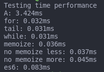

# The BEST factorial function

By using time performance tests, get the less time consuming function to do a factorial operation!

## Results

Using the following methods:
- For-loop
- While-loop
- Tail recursion
- Memoize
- Less characters in a recursive function
- Same recursive function but more characters
- ES6 type function

## Conclusion

It appears that there is no difference between most methods, but the ES6 function might be the slowest one by peeking at 0.083ms while the other ones stay at a 0.03 to 0.04 margin.
Either way, the BEST factorial function out of all is the one that performs best and has no readability issues. So for me, the Tail Recursion ones since they are shorter and easy to read.

### TO-DO

Exhaustive perfomance testing by checking memory, time, CPU usage, etc.