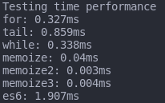

# The BEST factorial function

By using time performance tests, get the less time consuming function to do a factorial operation of 10.000!

## Results

Using the following methods:
- For-loop
- While-loop
- Tail recursion
- Memoize
- ES6 type function

## Conclusion

It appears that there is no difference between most methods, but the ES6 function might be the slowest one by peeking at 1.907 ms while the other ones stay at a 0.8 to 0.3 margin.
The memoize technique is by far the best function permormance-wise, because it last 0.04 ms to complete, and after the initial execution, the following ones will complete at 0.004 ms at most. Worth to check out!
Either way, the BEST factorial function out of all is the one that performs best and has no readability issues. So for me, the Tail Recursion ones since they are shorter and easy to read. BUT, you should have in mind the memoization technique for really large projects where some functions are intensively consuming.

### TO-DO

Exhaustive perfomance testing by checking memory, time, CPU usage, etc.